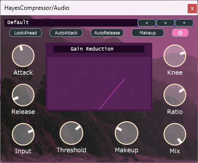

# HayesCompressor
A free, open-source Compressor audio plug-in.
It provides both input and output gain, a meter to visualize gain reduction, as well as attack, release, threshold, ratio, and knee controls that are very useful in shaping the response of the compressor.
Written with JUCE.

